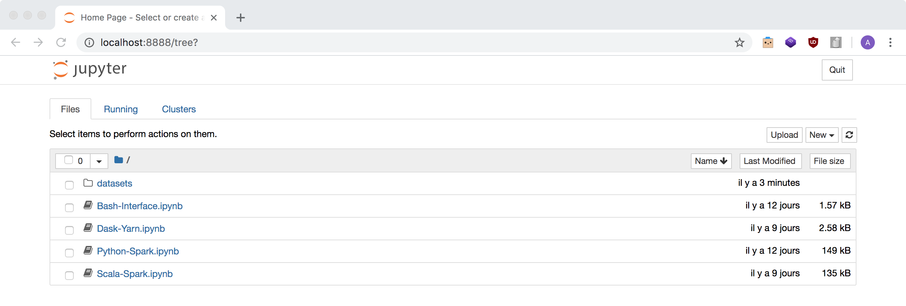

# Infnet: Fundamentos de Infraestrutura para Big Data <br/> Spark & Hadoop

### Exercícios

- F1: [F1.md](exercises/F1.md)
- Pagamentos Bolsa Família: `TBD`

### Dependências

- Docker Desktop
  - Windows: [https://docs.docker.com/desktop/install/windows-install/](https://docs.docker.com/desktop/install/windows-install/)
  - MacOS: [https://docs.docker.com/desktop/install/mac-install/](https://docs.docker.com/desktop/install/mac-install/)
  - Linux: [https://docs.docker.com/desktop/install/linux-install/](https://docs.docker.com/desktop/install/linux-install/)
- Git Bash
  - Windows: [https://gitforwindows.org/](https://gitforwindows.org/)

### Árvore de diretórios do projeto

```
├── docker-compose.yml
├── Dockerfile
├── confs
│   ├── config
│   ├── core-site.xml
│   ├── hdfs-site.xml
│   ├── mapred-site.xml
│   ├── requirements.req
│   ├── slaves
│   ├── spark-defaults.conf
│   └── yarn-site.xml
├── datasets
│   ├── alice_in_wonderland.txt
│   └── iris.csv
│   └── 202001_BolsaFamilia_Pagamentos.csv
│   └── f1
│     |── circuits.csv
│     |── constructorResults.csv
│     |── constructorStandings.csv
│     |── constructors.csv
│     |── driverStandings.csv
│     |── drivers.csv
│     |── lapTimes.csv
│     |── pitStops.csv
│     |── qualifying.csv
│     |── races.csv
│     |── results.csv
│     |── seasons.csv
│     └── status.csv
├── notebooks
│   ├── Bash-Interface.ipynb
│   ├── Dask-Yarn.ipynb
│   ├── Python-Spark.ipynb
│   └── Scala-Spark.ipynb
└── script_files
    └── bootstrap.sh
```

### Download datasets

- `202001_BolsaFamilia_Pagamentos.csv`
  - [https://portaldatransparencia.gov.br/download-de-dados/bolsa-familia-pagamentos](https://portaldatransparencia.gov.br/download-de-dados/bolsa-familia-pagamentos)
- `alice_in_wonderland.txt`
  - [https://gist.github.com/phillipj/4944029](https://gist.github.com/phillipj/4944029)
- `F1`
  - [https://www.kaggle.com/datasets/cjgdev/formula-1-race-data-19502017](https://www.kaggle.com/datasets/cjgdev/formula-1-race-data-19502017)
- `iris.csv`
  - [https://archive.ics.uci.edu/ml/datasets/iris](https://archive.ics.uci.edu/ml/datasets/iris)

### Comando para criação da imagem base do projeto

```bash
docker build . -t cluster-base
```

### Comando para execução do cluster

```bash
docker-compose up -d
```

Parâmetro `-d` inicializa a aplicação em background

### Comando para listar os containers docker em execução

```bash
docker ps
```

### Interface gráfica de gerenciamento do cluster - Yarn

Acesse a interface gráfica de gereciamento Yarn através do link: [http://localhost:8088/cluster/nodes](http://localhost:8088/cluster/nodes)


### Jupyter notebook

Acesse o Jupyter Notebook através do link: [http://localhost:8888/](http://localhost:8888/)



### Interrompendo o uso do cluster

```
docker-compose down
```

Caso queira apagar todos os volumes associados ao projeto, basta inserir o parâmetro `-v` no comando acima <br/>
Cuidado que isso faz com que todo o projeto seja baixado e configurado do ZERO!

### Referências

- Micro-Cluster Lab Using Docker, To Experiment With Spark & Dask on Yarn (base project)
  - Article: [https://lemaizi.com/blog/creating-your-own-micro-cluster-lab-using-docker-to-experiment-with-spark-dask-on-yarn/](https://lemaizi.com/blog/creating-your-own-micro-cluster-lab-using-docker-to-experiment-with-spark-dask-on-yarn/)
  - Project: [https://github.com/aminelemaizi/micro-cluster-lab](https://github.com/aminelemaizi/micro-cluster-lab)
